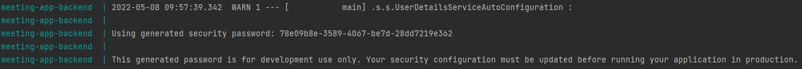

# Meeting application API

## Run application in docker

```
docker-compose build
```

```
docker-compose up
```
### Accessing resources
* Login will be requested when trying to access http://localhost:8080/. Use following credentials:
  * (only in development)
```
User name: user 
Password: -autogenerated for each application run-
```
* Password example in terminal

## API documentation

### Static documentation

* Visit: [swaggerhub.com](https://app.swaggerhub.com/apis/einnovations/meeting-app-documentation/1.0)


### Interactive documentation

* Run project and then go to: [http://localhost:8080/swagger-ui/](https://app.swaggerhub.com/apis/einnovations/meeting-app-documentation/1.0)

### Reference documentation

For further reference, please consider the following sections:

* [Official Apache Maven documentation](https://maven.apache.org/guides/index.html)
* [Spring Boot Maven Plugin Reference Guide](https://docs.spring.io/spring-boot/docs/2.6.6/maven-plugin/reference/html/)
* [Create an OCI image](https://docs.spring.io/spring-boot/docs/2.6.6/maven-plugin/reference/html/#build-image)
* [Swagger for spring boot](https://www.baeldung.com/swagger-2-documentation-for-spring-rest-api)
* [Spring boot security for Azure - Microsoft guide](https://docs.microsoft.com/en-us/azure/developer/java/spring-framework/spring-boot-starter-for-azure-active-directory-developer-guide)
* [Spring boot security for Azure - git repo](https://github.com/Azure-Samples/azure-spring-boot-samples/tree/spring-cloud-azure_4.0.0/aad/spring-cloud-azure-starter-active-directory/web-client-access-resource-server/aad-resource-server)
* [Project lombok](https://projectlombok.org/)
